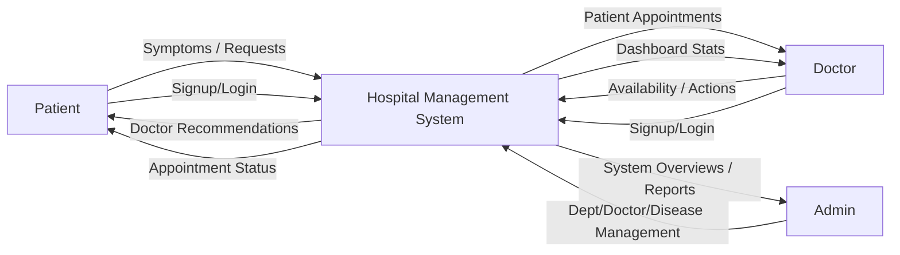
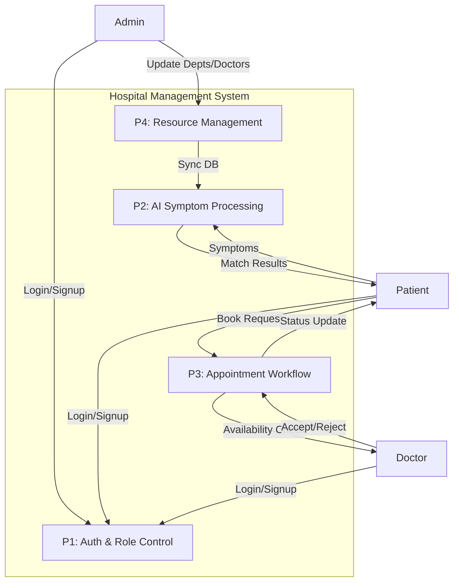
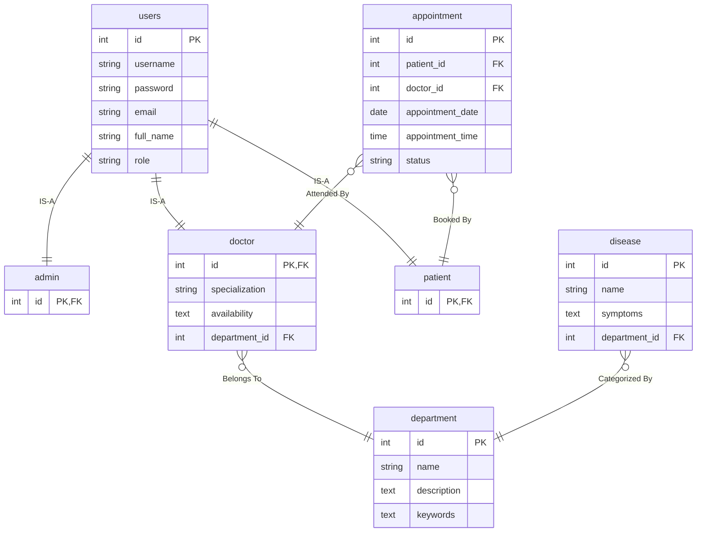

# Hospital Management System: Project Documentation

This document details the data flow, entity relationships, and database structure for the Hospital Management System.

---

## 1. Data Flow Diagrams (DFD)

### DFD Level 0 (Context Diagram)
Visualizes high-level system interactions.

---

### DFD Level 1
Breaks down the core sub-processes of the application.

---

## 2. Entity Relationship (ER) Diagram
Details the 3-table inheritance model and medical relationships.

---

## 3. Database Schemas
Flat SQL table definitions for the current implementation.

### Table: `users`
| Column | Type | Constraints |
| :--- | :--- | :--- |
| `id` | INT | PRIMARY KEY, AUTO_INCREMENT |
| `username` | VARCHAR(150)| UNIQUE, NOT NULL |
| `password` | VARCHAR(128)| NOT NULL (Hashed) |
| `email` | VARCHAR(254)| NOT NULL |
| `full_name` | VARCHAR(200)| |
| `role` | VARCHAR(10) | 'admin', 'doctor', 'patient' |
| `image` | VARCHAR(100)| NULLABLE (Path to media) |

### Table: `doctor`
| Column | Type | Constraints |
| :--- | :--- | :--- |
| `id` | INT | PRIMARY KEY, FOREIGN KEY (`users.id`) |
| `department_id`| INT | FOREIGN KEY (`department.id`) |
| `specialization`| VARCHAR(200)| |
| `availability`| TEXT | (e.g. "Mon-Fri 09:00-17:00") |

### Table: `patient`
| Column | Type | Constraints |
| :--- | :--- | :--- |
| `id` | INT | PRIMARY KEY, FOREIGN KEY (`users.id`) |

### Table: `admin`
| Column | Type | Constraints |
| :--- | :--- | :--- |
| `id` | INT | PRIMARY KEY, FOREIGN KEY (`users.id`) |

### Table: `appointment`
| Column | Type | Constraints |
| :--- | :--- | :--- |
| `id` | INT | PRIMARY KEY, AUTO_INCREMENT |
| `patient_id` | INT | FOREIGN KEY (`patient.id`) |
| `doctor_id` | INT | FOREIGN KEY (`doctor.id`) |
| `appointment_date`| DATE | |
| `appointment_time`| TIME | |
| `status` | VARCHAR(10) | Default: 'pending' |
| `symptoms` | TEXT | |

### Table: `department`
| Column | Type | Constraints |
| :--- | :--- | :--- |
| `id` | INT | PRIMARY KEY, AUTO_INCREMENT |
| `name` | VARCHAR(100)| UNIQUE |
| `description` | TEXT | |
| `keywords` | TEXT | (Symptom words for AI) |
